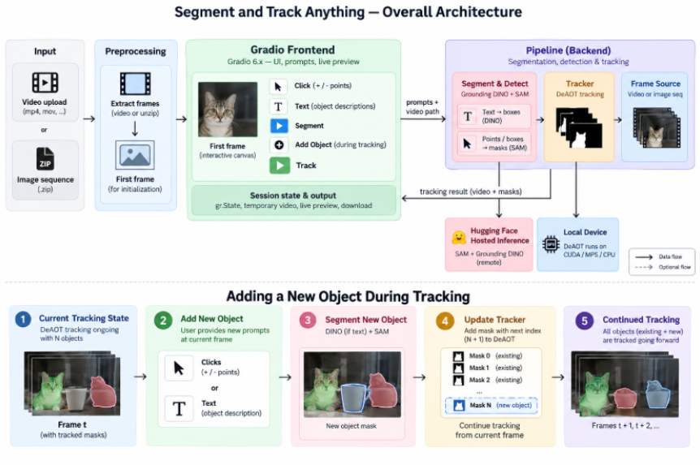

# Segment and Track Anything

> A modernized, lightweight refactor of **Segment and Track Anything (SAM-Track)**.
> Engineered for high-accuracy, non-real-time mask propagation — built on clean and modern PyTorch and Hugging Face backends with zero legacy dependency debt.

## Introduction

**Segment-and-Track-Anything** is a video segmentation and tracking framework designed to segment and track objects throughout a video. It brings together interactive and automatic methods for selecting objects of interest and maintaining their segmentation across frames.

The project is built around the idea of combining powerful image-level segmentation with dedicated video tracking. The original Segment and Track Anything (SAM-Track) framework combines the Segment Anything Model (SAM) for obtaining object masks on reference frames with DeAOT, an AOT-based video object tracking model, to propagate those masks across subsequent frames. It also integrates Grounding-DINO to enable text-guided object selection.

This project is a substantially refactored implementation of the original SAM-Track software. The underlying segmentation and tracking approach is preserved, while the application and inference stack have been redesigned around modern model backends, explicit object state, streaming execution, and a substantially smaller dependency and model footprint.

## What Changed

### Legacy `SegTracker` vs modern refactored `Pipeline`

| Dimension | `SegTracker` (legacy) | `Pipeline` (refactored) |
|---|---|---|
| **SAM / Grounding-DINO** | Vendored in-repo (`sys.path.append("./sam")`, `from sam.segment_anything import ...`, `from tool.detector import Detector`) — two full external repos cloned into the project | Delegated to Hugging Face inference via thin `inference.sam_segmentor` / `inference.dino_detector` HF wrappers — no vendored clones |
| **"Segment everything"** | `seg()` calls `SAM.everything_generator.generate(frame)` — segments the *entire* frame every `sam_gap` frames (default gap = 100 frames, max_obj = 255 ~3.33s @30fps), then discards most of it via `min_area`/`max_obj_num` filtering | Removed entirely. No automatic mask generator anywhere. Only bounded, user-driven mask creation remains: `seg_acc_click` (point prompts) and `detect_and_seg` (Grounding-DINO boxes) |
| **Why remove it** | Segment-everything routinely proposes far more regions than can ever be tracked | DeAOT hard-caps at ~10 tracked objects by design — an unbounded whole-frame segmentation that gets immediately truncated to 10 objects is wasted GPU work on every `sam_gap` boundary |
| **GC / CUDA cache calls** | `gc.collect()` + `torch.cuda.empty_cache()` called in pairs, *inside the per-frame loop*: 1 pair unconditionally every frame, +1 extra pair on frame 0, +1 extra pair every `sam_gap`-th frame | Zero occurrences in the class. No cache-thrash pattern in the orchestration layer at all |
| **Cost of that pattern** | ≈2 calls/frame baseline, spiking to 4 on frame 0 and every `sam_gap`-th frame — for a 1,000-frame clip that's on the order of 1,000+ full GC passes plus 1,000+ CUDA allocator flushes | N/A — device/memory concerns pushed down into the tracker module instead of scattered through the video loop |
| **Model loading** | Models are initialized eagerly through `SegTracker` setup, loading all components regardless of usage | Models are loaded lazily by their respective inference modules only when first requested |
| **Device support** | `DEVICE = torch.device("cuda" if torch.cuda.is_available() else "cpu")` — binary CUDA/CPU only; `autocast` only enabled under CUDA → no Apple Silicon acceleration path | Device selection and autocast live in `deaot_tracker.Tracker`, which is CUDA/MPS-aware — `Pipeline` itself is hardware-agnostic |
| **Video decode passes** | **Two** full decodes of the same input: pass 1 runs inference and builds `pred_list`; pass 2 *reopens* `cv2.VideoCapture(input_video)` purely to render masks | **One** decode. `track_video_sequence` is a single generator, rendering and `yield`-ing `(masked_frame, frame_idx)` inline in the same pass as inference |
| **DeAOT codebase** | Full AOT benchmark repository with generic training infrastructure and unused components — 30+ files carried into the project | Stripped down to the single supported DeAOT inference path, retaining only required code — approximately 10 files remain |
| **Output artifacts** | Mask PNGs per frame, masked-frame PNGs per frame, output `.mp4`, output `.gif`, **and** a `.zip` of all mask PNGs — all five written unconditionally to disk | None written by the class itself — it yields frames; the Gradio caller owns persistence |
| **Inference time** | ~100 seconds to process a 3-second video on CPU | ~20 seconds to process the same 3-second video on CPU (~5× faster CPU inference) |
| **Video vs. image-sequence input** | Two ~100-line, near-duplicate methods reimplementing the entire pipeline twice, differing only in frame sourcing | One `_get_frame_source` generator handling both video (`cv2.VideoCapture`) and zip-based image sequences behind a single interface |
| **Object/id bookkeeping** | `reference_objs_list` + `get_tracking_objs()`/`get_obj_num()` re-derive object count by scanning full history on every call | `current_mask` is the explicit single source of truth; `curr_idx` is kept consistent via `max(self.curr_idx, obj_num + 1)` |
| **Cancellation** | None — a run goes to completion or crashes | `threading.Event`-backed `stop_tracking()` checked inside the frame generator |
| **Input validation** | None — assumes well-formed masks/frames throughout | Explicit guards (`ValueError`/`RuntimeError` with messages) on `None` masks, wrong `ndim`, and uninitialized trackers |
| **Progress reporting** | Inline `print(..., end='\r')` statements mixed into core logic | No progress logic in pipeline — exposed through per-frame `yield` |
| **Dead code** | Large commented-out blocks left in place | None |
| **Method naming** | Instance methods take `SegTracker` as their first parameter name instead of `self` | Consistent `self`, methods grouped under clear section-comment headers |

---

### Legacy Dockerfile vs Modern Refactored Dockerfile

| Dimension | `Dockerfile` (legacy) | `Dockerfile` (refactored) |
|---|---|---|
| **Container base & CUDA stack** | `pytorch/pytorch:2.0.1-cuda11.8-cudnn8-devel` — PyTorch 2.0.1, CUDA 11.8, cuDNN 8, heavyweight development image | `pytorch/pytorch:2.13.0-cuda13.2-cudnn9-runtime` — PyTorch 2.13.0, CUDA 13.2, cuDNN 9, lightweight runtime image |
| **System dependencies & build toolchain** | Explicitly installs `build-essential`, `cmake`, `git`, `ffmpeg`, `wget`, `curl`, `python3-dev`, and manually sets `CUDA_HOME` | No explicit apt toolchain; relies on runtime base image and Python dependencies declared in `requirements.txt` |
| **Python dependency management** | Large inline `pip install` block with ~20 tightly pinned packages, followed by separate editable installs for `sam` and GroundingDINO | Dependencies centralized in `requirements.txt` focusing on `opencv-python-headless`, `gradio`, and Hugging Face `transformers` |
| **Build efficiency & image footprint** | `COPY . .` occurs before dependency installation; installs dev tooling; pip caching not explicitly disabled | Copies `requirements.txt` first, installs with `--no-cache-dir`, then copies application source; `PIP_NO_CACHE_DIR=1` enabled globally |

---

### Legacy Gradio Frontend vs modern refactored Gradio Frontend

| Dimension | Legacy `app.py` (Gradio 3.39) | Refactored `application.py` (Gradio 6.x) |
|---|---|---|
| **Gradio API generation** | `.style(height=550)`, `gr.Image(tool="sketch", brush_radius=10)`, `gr.outputs.Textbox(...)`, `app.queue(concurrency_count=1)`, `app.launch(debug=True, enable_queue=True, share=True)` — all pre-4.0 idioms, several since removed from the library | `height=` kwarg directly on components, no legacy `gr.outputs` module, `.queue()`/`.then(..., concurrency_limit=1)` chaining, `demo.queue().launch(css=..., share=False)` — current API throughout |
| **Model configuration** | User-tunable `aot_model` dropdown (deaotb / deaotl / r50_deaotl), plus `long_term_mem`, `max_len_long_term`, `points_per_side`, `sam_gap`, `max_obj_num` sliders — a whole "SegTracker Args" panel | Fixed `deaot_args` / `dino_args` / `sam_args` module config, no model picker in the UI — one deliberately-chosen, high-accuracy DeAOT configuration, not a user-facing knob |
| **Click → SAM invocation** | Every single click fires `sam_click` → `seg_acc_click` → one SAM call, immediately followed by `SegTracker_add_first_frame`, which calls `restart_tracker()` + `add_reference()` — i.e. a full tracker reset and re-embed per click | Clicks accumulate in `coords`/`modes`; "Add Point Group" (`add_new_object`) just delimits one object's clicks from the next with no model call; the eventual "Segment / Add Object Reference" click sends **all** accumulated point-groups in one `seg_acc_click(..., coords_groups, modes_groups)` call — N objects, 1 SAM invocation |
| **Reference-frame commit** | `SegTracker_add_first_frame` unconditionally calls `restart_tracker()` on *every* click/stroke/detect action, discarding all previously tracked objects each time | `_commit_segmentation` diffs `prev_ids` vs `curr_ids` in the returned mask and only calls `initialize_reference` (first time) or `add_objects` (new ids only) — existing tracked objects are never silently wiped by a later action |
| **"Everything" tab / segment-everything** | Present: `seg_every_first_frame` → `segment_everything()` → `Seg_Tracker.seg()` (SAM's whole-frame automatic mask generator), wrapped in its own `torch.cuda.amp.autocast()` + explicit `torch.cuda.empty_cache()`/`gc.collect()` right in the click handler | Removed entirely — no tab, no handler, no `points_per_side`/`sam_gap` sliders. A single DeAOT model has a hard per-clip object ceiling, so segmenting the whole frame (sky, ground, background) only to discard most of it doesn't fit the design |
| **Stroke tab** | original: a sketch-tool drawing board (`tool="sketch"`) → `mask2bbox` → `seg_acc_bbox`, added specifically to reduce the number of individual clicks needed under the old one-click-one-SAM-call constraint | Removed — with clicks now batched per object, stroke-to-avoid-repeated-invocations is solving a problem that no longer exists |
| **Audio Grounding tab** | original: `audio_to_text()` shells out to `ffmpeg` (subprocess) to split audio, runs an AST (`ast_master.prepare.ASTpredict`) model to get top-label probabilities, then feeds the resulting text into `gd_detect` as a Grounding-DINO prompt — a full extra model, an `ffmpeg` dependency, two sliders, and a `Label` widget | Removed entirely — text prompting already covers the same end result (a user typing "dog" gets the same Grounding-DINO call an audio label would have produced), so the extra model/dependency chain added cost without adding capability |
| **Rollback / refine subsystem** | Present, and large: a "percentage of frames viewed" slider + `output_res` image reads back previously-written mask/frame PNGs from disk (`res_by_num`, `show_res_by_slider`); `choose_obj_to_refine` picks an object by clicking a historical frame; `show_chosen_idx_to_refine` manually resets ~9 internal `SegTracker` fields by hand instead of calling one method; a parallel set of roll-back click/undo/track handlers re-runs tracking from an arbitrary past frame | Removed entirely. Instead: **"Add Objects During Tracking"** (`pause_and_load_frame_for_segmentation`) soft-stops the live generator (`tracker.stop_tracking()`) and loads the *current* frame for new prompts — forward-only; there is no mechanism to rewind to a historical frame |
| **Periodic re-segmentation during tracking** | Implicit and time-based: `sam_gap` re-triggers a full SAM segment-everything pass on a fixed frame interval (~100 frames / ~3.3s by default) regardless of whether a new object actually entered the scene | Explicit and user-driven: "Add Objects During Tracking" pauses the stream and lets the user hand-place prompts for exactly the new object, exactly when one appears — no periodic re-scan of the whole frame |
| **Tracking output** | Blocking call to `tracking_objects_in_video`; UI populates static `output_video` **and** `output_mask` (a zip of mask PNGs) `gr.File` components only after the entire two-pass job finishes — no visible progress | `tracking_objects` is a generator that writes each frame to a session-scoped temp `.mp4` as it arrives and yields it straight to `output_frame` for live progress; on completion the single finished video is exposed via `output_file`. No mask zip, no gif |
| **Output-file lifecycle** | No cleanup logic — files accumulate in `tracking_results/<name>/...` across runs | `_TRACKING_OUTPUTS` session dict + `_create_tracking_output`/`_discard_tracking_output`/`_finish_tracking_output` explicitly manage one temp file per session, discarding/removing stale output on reset or re-selection so nothing is silently duplicated or overwritten |
| **Concurrency** | One global `app.queue(concurrency_count=1)` serializes *every* interaction in the entire app | `concurrency_limit=1` is scoped only to the tracking `.then(...)` call itself; unrelated UI interactions aren't forced through the same single-worker queue |
| **Validation / error handling** | None — no `gr.Error` anywhere; tracking with no prior segmentation or a missing input simply fails deep inside the call stack | Explicit `gr.Error` checks: no mask before tracking, video-XOR-image-seq input, wrapped `try/except` around the tracking generator with a surfaced failure message |
| **State reset** | `show_chosen_idx_to_refine` manually zeroes ~9 attributes on the tracker object by hand (`curr_idx`, `object_idx`, `origin_merged_mask`, `first_frame_mask`, `reference_objs_list`, `everything_points`, `everything_labels`, `sam.have_embedded`, `sam.interactive_predictor.features`) instead of one reset call | `reset_state`/`reset_SegTracker` call `tracker.restart_tracker()` once; all bookkeeping lives inside the class, not hand-mirrored in the frontend |
| **Sharing** | `share=True` by default — every launch opens a public tunnel | `share=False` — no forced public link |
| **Dead code / unused imports** | Unused `from matplotlib.pyplot import step`, unused `importlib`/`argparse`/`time`, duplicate `import json`, three fully commented-out reset-button handlers, commented-out `pdb.set_trace()` calls, commented-out example video paths | None found |
| **Dependency surface** | `ast_master` package, `ffmpeg` subprocess dependency, `skimage`, direct SAM/GroundingDINO subrepo imports (carried over from the backend) | `os`, `tempfile`, `zipfile`, `cv2`, `gradio`, `numpy`, `pipeline` — no audio, no vendored model repos |


## Architecture

<p align="center">
  
</p>

SAM-Track is split into two independent layers: a Gradio frontend that owns nothing but UI state, and a `Pipeline` backend that owns every model call. The frontend never talks to a model directly — it only calls into `Pipeline`, so the whole interactive surface (click prompts, text prompts, live tracking preview, file download) can change without touching a single inference call, and vice versa.

**Frontend.** The UI collects two kinds of input — point clicks and text prompts — and batches them before anything gets sent to the backend. Clicks for one object accumulate locally; an explicit "add object" action closes that group and starts the next one, so an arbitrary number of objects can be prompted before a single request goes out. Session state (accumulated prompts, the current tracker instance, the in-progress output file) lives entirely in Gradio's own state components, and tracking output is written to a session-scoped temp file that gets cleaned up on reset instead of accumulating on disk.

**Backend.** `Pipeline` wraps three components — a segmentor, a detector, and a tracker — behind one interface. Segmentation (SAM) and text-grounded detection (Grounding-DINO) are both delegated to hugging face, so the app never has to load or manage those models locally. Tracking (DeAOT) is the one model that actually runs on-device, with the CUDA/MPS/CPU selection handled entirely inside the tracker module — `Pipeline` itself is hardware-agnostic. A single frame-source abstraction handles both video files and zipped image sequences behind one generator, so the rest of the pipeline doesn't need to know which kind of input it's looking at.

**Data flow.** A batched click or text prompt produces one mask from the segmentor/detector; the pipeline diffs that mask against whatever's already tracked and commits only the genuinely new object ids to the tracker's reference set. Once tracking starts, `Pipeline` yields one rendered frame at a time from a single decode pass — the frontend writes each frame to the output video as it arrives and mirrors it to a live preview, so the UI shows progress instead of blocking until the whole clip is done. Tracking can be paused mid-stream to add a newly-appeared object, then resumed, without restarting or rewinding.

The result is a clear boundary: local compute is reserved for the one model that has to run continuously frame-to-frame, while segmentation and detection are invoked only when needed, and the frontend layer remains independent of the inference backend.

## Supported Models

| Component | Model | Purpose |
|---|---|---|
| **Segmentation** | SAM | Interactive point-based image segmentation |
| **Detection** | Grounding-DINO | Text-guided object detection |
| **Tracking** | R50-DeAOT-L | Video mask propagation and temporal tracking |

The refactored implementation intentionally supports a single DeAOT configuration rather than carrying the full AOT benchmark and training infrastructure. Only the inference components required by the selected tracker are retained.

## Getting Started

Segment-and-Track-Anything supports two deployment paths:

| Hardware | Recommended Deployment |
| :--- | :--- |
| **CPU** | Native Python installation |
| **NVIDIA GPU** | Docker with the prebuilt GHCR image |

> **Note:** The prebuilt Docker image is canonical GPU deployment. GPU users need not install any python dependencies manually.

---

### 1. CPU Installation

#### Step 1: Create and activate a virtual environment

```bash
python -m venv venv
```

After creating, activate your virtual environment.

#### Step 2: Install the dependencies

```bash
python -m pip install --upgrade pip
python -m pip install -r requirements.txt
```

---

### 2. GPU Installation — Docker

Docker is the canonical GPU deployment method for this project.

We provide a prebuilt GPU image through GitHub Container Registry (GHCR). The image includes the complete runtime, including:

- PyTorch
- Opencv
- Gradio
- Transformers

#### Pull and Run the Prebuilt Image

GPU users can pull and start the prebuilt image directly:

```bash
docker compose -f docker-compose.ghcr.yml up
```

Docker Compose will pull the image from GHCR automatically if it is not already available locally.

#### Build from Source

For development or when modifying the Docker image, you can build it locally:

```bash
docker compose up --build
```

---

## Running Segment-and-Track-Anything

### Native CPU Inference

* **Gradio Interface:**

  ```bash
  python app.py
  ```

### Docker GPU Inference

The Docker Compose configuration starts using the containerized application stack.

To stop the containers:

```bash
docker compose down
```

---

## Credits

This project builds upon the work of the authors of **Segment and Track Anything (SAM-Track)**, developed under the **ReLER Lab at Zhejiang University’s College of Computer Science and Technology**.

We gratefully acknowledge the contributions of:

**Yangming Cheng, Liulei Li, Yuanyou Xu, Xiaodi Li, Zongxin Yang, Wenguan Wang, and Yi Yang.**

For the original research and implementation, please refer to:

- **Paper:** *Segment and Track Anything*, Cheng et al., 2023
- **arXiv:** [arXiv:2305.06558](https://arxiv.org/abs/2305.06558)
- **Original repository:** [Segment and Track Anything](https://github.com/z-x-yang/Segment-and-Track-Anything)

The original work was supervised by **Yi Yang**, Qiu Shi Distinguished Professor at Zhejiang University, through the ReLER Lab.

--

## License

This project is licensed under the **GNU Affero General Public License v3.0 (AGPL-3.0)**.

See the [`LICENSE`](LICENSE) file for the full license text.

This project is a modified and refactored version of **Segment and Track Anything (SAM-Track)** and retains the original project's AGPL-3.0 licensing terms.

---

## Citation

If you use this project, please cite the original **Segment and Track Anything**
work on which this project is based:

```bibtex
@article{cheng2023segment,
  title={Segment and Track Anything},
  author={Cheng, Yangming and Li, Liulei and Xu, Yuanyou and Li, Xiaodi and Yang, Zongxin and Wang, Wenguan and Yang, Yi},
  journal={arXiv preprint arXiv:2305.06558},
  year={2023}
}